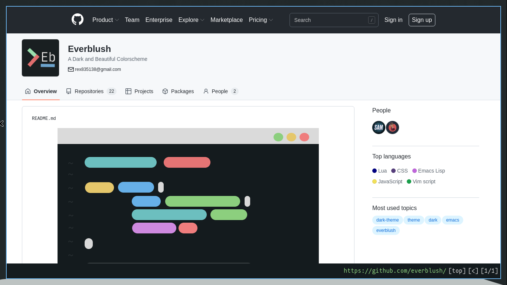
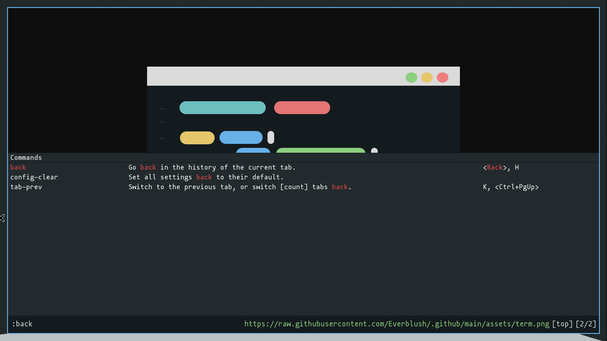
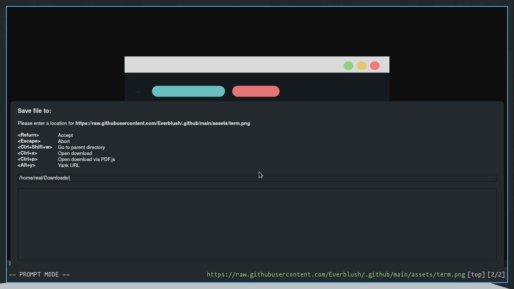

<h2 align="center">Everblush Qutebrowser Theme.</h2>

<p align="center"> 
   
  
  
  
</p>

## Preview





## Installation 

1. Download `everblush.py` into your `~/.config/qutebrowser`
```bash
curl -L https://raw.githubusercontent.com/Everblush/qutebrowser/main/src/qutebrowser.py -O ~/.config/qutebrowser/everblush.py
```

2. Add the following line into your `~/.config/qutebrowser/config.py`
```python
config.source("everblush.py")
```

## Credits 💝
- [real-fht](https://github.com/real-fht)
